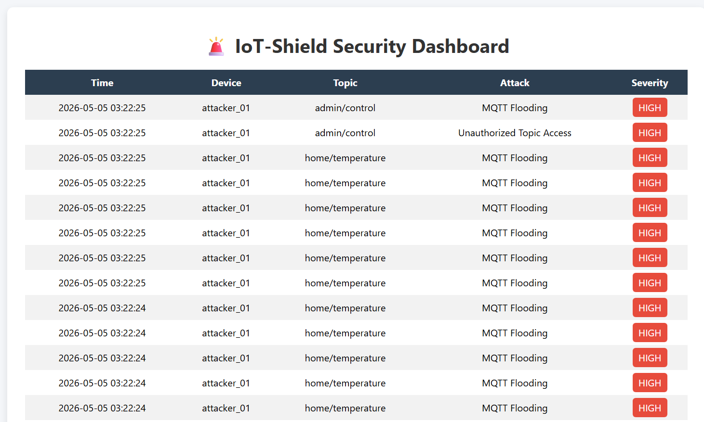
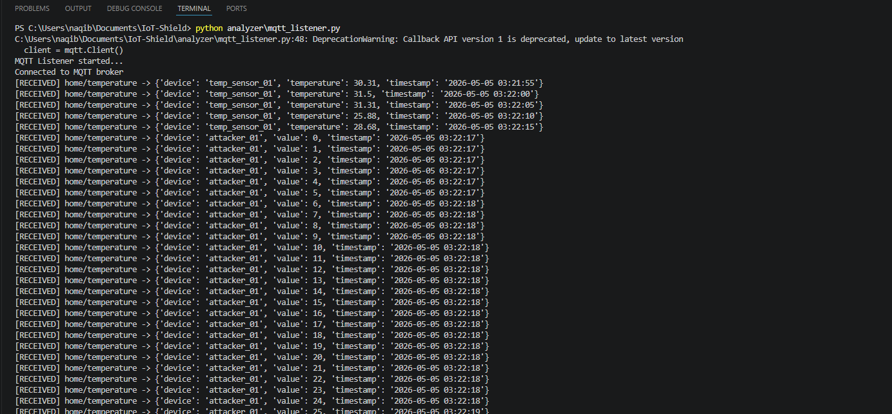
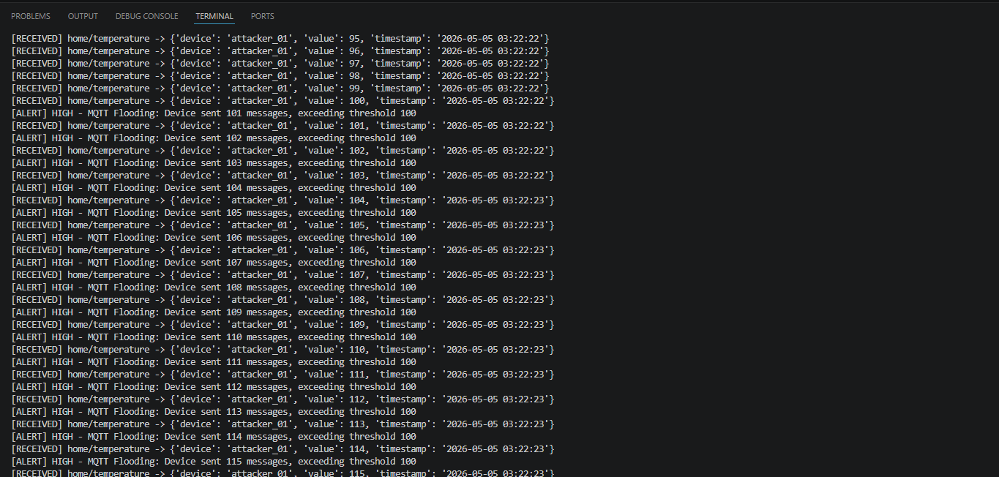
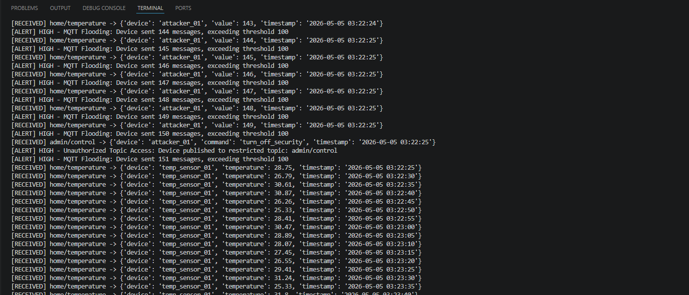

# IoT-Shield

## Overview
IoT-Shield is a lightweight intrusion detection system for MQTT-based IoT networks. It monitors real-time traffic, detects abnormal behavior, and visualizes alerts.

## Features
- Real-time MQTT monitoring
- Rule-based intrusion detection
- Attack simulation (flooding, unauthorized access)
- Alert logging (SQLite + log files)
- Web dashboard visualization

## System Architecture
IoT Devices → MQTT Broker → Listener → Detection Engine → Database → Dashboard

## How to Run

### 1. Start Listener
python analyzer/mqtt_listener.py

### 2. Start Dashboard
python dashboard/app.py

Open: http://127.0.0.1:5000

### 3. Start Normal Traffic
python simulator/normal_publisher.py

### 4. Run Attack Simulation
python simulator/attack_publisher.py

## Technologies Used
- Python
- MQTT (Mosquitto)
- Flask
- SQLite

## Future Improvements
- Machine learning-based detection
- Support for CoAP protocol
- Real-time analytics dashboard

## Demo Screenshots

### Dashboard View

---

### Alert Detection (Terminal Output)

#### Example 1

#### Example 2

#### Example 3
